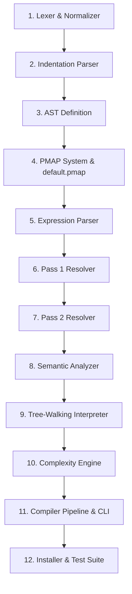

# Pseudo Compiler Implementation Guide & Timeline

This document provides a chronological timeline and step-by-step walkthrough for a programmer who wants to rebuild the Pseudo compiler manually from scratch. It lists the files, their exact line counts, and the order in which they should be implemented.

---

## Chronological Implementation Timeline

To build this compiler successfully, you should follow this exact sequence:

| Order  | Phase                 | Target File                         | Lines  | Purpose / Core Logic                                                                                                           |
| :----: | :-------------------- | :---------------------------------- | :----- | :----------------------------------------------------------------------------------------------------------------------------- |
| **1**  | Initialize package    | `pseudo/__init__.py`                | 1–4    | Define the package entry, export versions.                                                                                     |
| **2**  | Lexer                 | `pseudo/parser/tokenizer.py`        | 1–266  | Tokenize raw characters into tokens (handling numbers, strings, keywords, operators like ternary `?`, brackets, etc.).         |
| **3**  | Text Normalizer       | `pseudo/parser/normalizer.py`       | 1–56   | Normalize whitespaces and line contents before pattern matching.                                                               |
| **4**  | Indent & Blocks       | `pseudo/parser/indent_parser.py`    | 1–300  | Parse block structures by indentation, handle tab/space rules, and recursively split inline colon blocks (e.g. `if x: print`). |
| **5**  | AST Nodes             | `pseudo/parser/ast_nodes.py`        | 1–293  | Define Python dataclasses for all AST structures (Statements and Expressions, e.g. `TernaryNode`, `IfNode`, `ForLoopNode`).    |
| **6**  | Default Mappings      | `pseudo/data/default.pmap`          | 1–162  | Write the standard language syntax definition rules (mappings to canonical constructs).                                        |
| **7**  | Pattern Trie & Loader | `pseudo/resolver/pmap_loader.py`    | 1–706  | Parse `.pmap` syntax, build keyword trie structure, handle inherits/replaces, and support caching.                             |
| **8**  | Expression Parsing    | `pseudo/parser/expr_parser.py`      | 1–577  | Parse mathematical and logic expressions using recursive descent (supporting binary ops, functions, arrays, and ternaries).    |
| **9**  | Pass 1: Resolver      | `pseudo/resolver/pass1_register.py` | 1–199  | Scan block headers to build a complete symbol table of global functions and variables before execution.                        |
| **10** | Expose Resolvers      | `pseudo/resolver/__init__.py`       | 1–4    | Expose pass 1 and pass 2 interfaces.                                                                                           |
| **11** | Pass 2: Resolver      | `pseudo/resolver/pass2_resolver.py` | 1–988  | Match lines against mapped patterns in the Trie and construct the canonical AST.                                               |
| **12** | Static Analyzer       | `pseudo/analyzer/semantic.py`       | 1–320  | Validate AST, check for undefined variables, mismatching argument counts, and generate warnings.                               |
| **13** | Execution Engine      | `pseudo/interpreter/interpreter.py` | 1–1018 | Execute the AST tree recursively, manage stack/scopes, auto-print values, handle built-ins, and loop limits.                   |
| **14** | Complexity Analyzer   | `pseudo/analyzer/complexity.py`     | 1–611  | Walk the AST statically to calculate time and space complexity (Big-O notation).                                               |
| **15** | Compiler Pipeline     | `pseudo/compiler.py`                | 1–255  | Link tokenizer, resolver, semantic analyzer, interpreter, and complexity engine into a single compiler function.               |
| **16** | Command Line Tool     | `pseudo/cli.py`                     | 1–292  | Setup argparse, support run, explain, validate, and interactive local config init commands.                                    |
| **17** | CLI Main Run          | `pseudo/__main__.py`                | 1–4    | Map the `python -m pseudo` entrypoint to `cli.py`.                                                                             |
| **18** | Home Directory Init   | `pseudo/install.py`                 | 1–88   | Setup `~/.pseudo/` home folder, cache, and default configurations on first boot (handles PyInstaller bundle states).           |
| **19** | Testing               | `test.py`                           | 1–380  | Run full suite of unit tests and CLI integration tests.                                                                        |

---

## Detailed Step-by-Step Implementation

### Step 1: The Core Lexer and Normalizer

- **`pseudo/__init__.py` (1–4)**
  Initialize the module package and export version variables.
- **`pseudo/parser/tokenizer.py` (1–266)**
  Define token types (`NUMBER`, `STRING`, `IDENTIFIER`, `OPERATOR`, `QUESTION`, `COLON`, `EOF`, etc.). Iterate character-by-character to consume tokens. Handle escape characters in string literals, hexadecimal numbers, and identifiers.
- **`pseudo/parser/normalizer.py` (1–56)**
  Build clean utilities to normalize whitespaces, handle casing uniformly, and strip comments from statements.

### Step 2: Indentation and Block Hierarchy

- **`pseudo/parser/indent_parser.py` (1–300)**
  Build `RawLine` and `Block` classes. Calculate indentation depth. If a block starts with a keyword (like `if`, `while`, `for`) and has an inline colon separator (e.g. `if n == 10: print("ten")`), recursively split the line into a parent block and a deeper child block. Reject mixed tab/space files.

### Step 3: AST and PMAP System

- **`pseudo/parser/ast_nodes.py` (1–293)**
  Build dataclasses inheriting from `Node` (e.g., `ProgramNode`, `FuncDefNode`, `ForLoopNode`, `ForEachNode`, `TernaryNode`).
- **`pseudo/data/default.pmap` (1–162)**
  Define canonical blocks mapping patterns, e.g. `[FOR_LOOP]` and standard English forms.
- **`pseudo/resolver/pmap_loader.py` (1–706)**
  Implement `.pmap` file parser, a prefix trie data structure (`PmapTrie`), matching logic, pattern extraction, and dictionary hashing to cache loaded PMAP files.

### Step 4: Expression Parsing

- **`pseudo/parser/expr_parser.py` (1–577)**
  Write a recursive descent expression parser. Define operators with Python-identical precedence (e.g. unary `not`, logical `and`, relational `==`, arithmetic `+`, power `**`, and ternary `? :`). Parse arrays, lists, maps, function calls, slices, and index operations.

### Step 5: Dual-Pass Resolution

- **`pseudo/resolver/pass1_register.py` (1–199)**
  Walk block headers to register global variables and user-defined functions with parameter lists.
- **`pseudo/resolver/__init__.py` (1–4)**
  Expose resolve functions.
- **`pseudo/resolver/pass2_resolver.py` (1–988)**
  Resolve every block statement using the PMAP Trie matcher, and parse internal sub-expressions to form the complete `ProgramNode` AST.

### Step 6: Semantic Analysis & Execution

- **`pseudo/analyzer/semantic.py` (1–320)**
  Perform static validation checks. Ensure variables and functions are defined before use, check argument counts on calls, and warn about variables shadowing built-ins.
- **`pseudo/interpreter/interpreter.py` (1–1018)**
  Implement tree-walking evaluation. Maintain function scope stacks, intercept and queue `$input` buffers, format output visual displays, enforce infinite loop iteration count and execution timers, and raise/catch errors.

### Step 7: Complexity Analysis & Pipeline

- **`pseudo/analyzer/complexity.py` (1–611)**
  Statically walk the AST. Determine worst-case Big-O time and space complexity based on nesting loops, halving variables (e.g., binary search), recursion depth, and dynamic memory allocations.
- **`pseudo/compiler.py` (1–255)**
  Integrate compilation phases, compile-error handling, and return executed outputs, warning lists, and symbol tables.
- **`pseudo/cli.py` (1–292)**
  Configure command line interface arguments. Support execution, dry-runs, step-by-step debugging, explanation of mappings, and interactive project initialization.
- **`pseudo/__main__.py` (1–4)** and **`pseudo/install.py` (1–88)**
  Define CLI runner and set up environment directories (`~/.pseudo/`) when package initializes, fully supporting packaged executable environments.

### Step 8: Verification

- **`test.py` (1–380)**
  Write unit tests for expressions, control flow, functions, collections, data structures, and CLI integration options to ensure stability.
